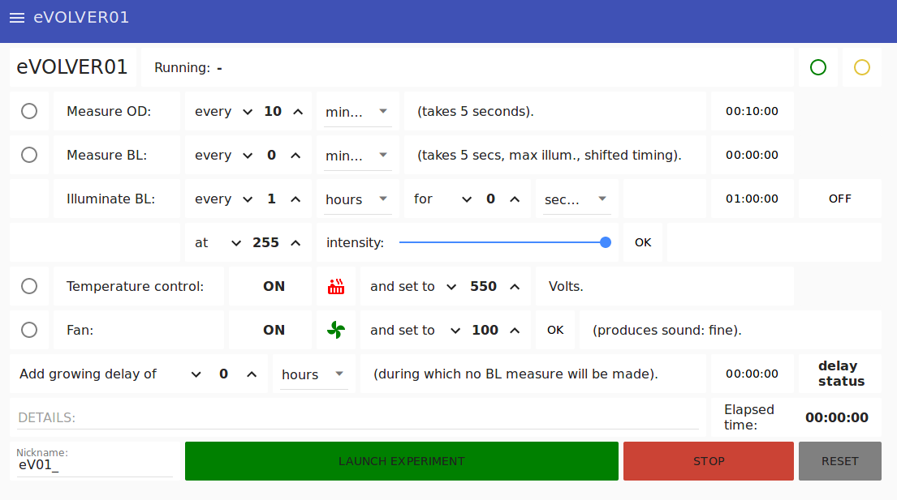
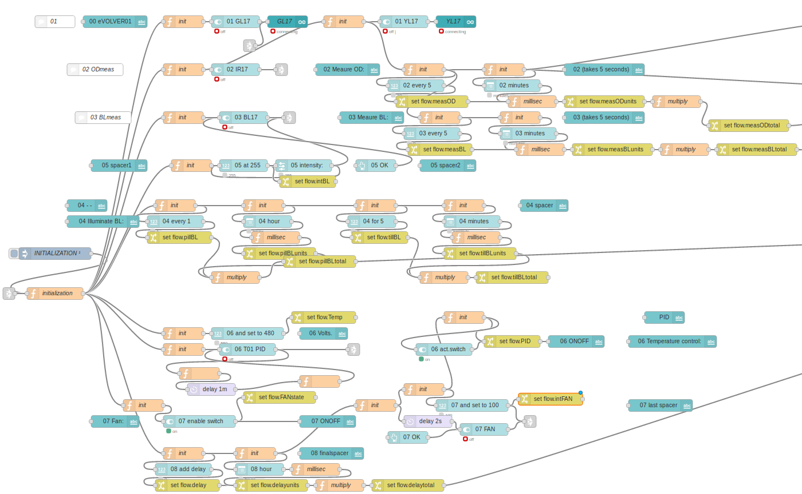
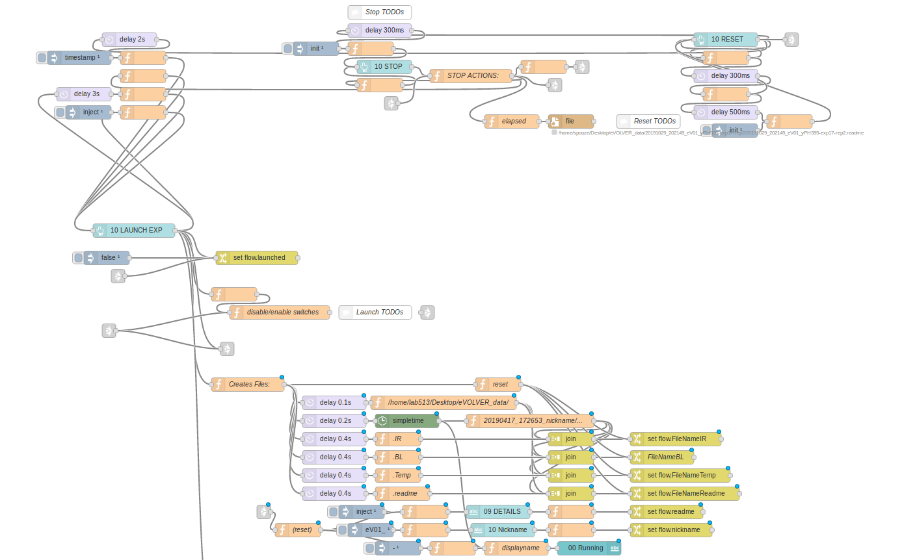
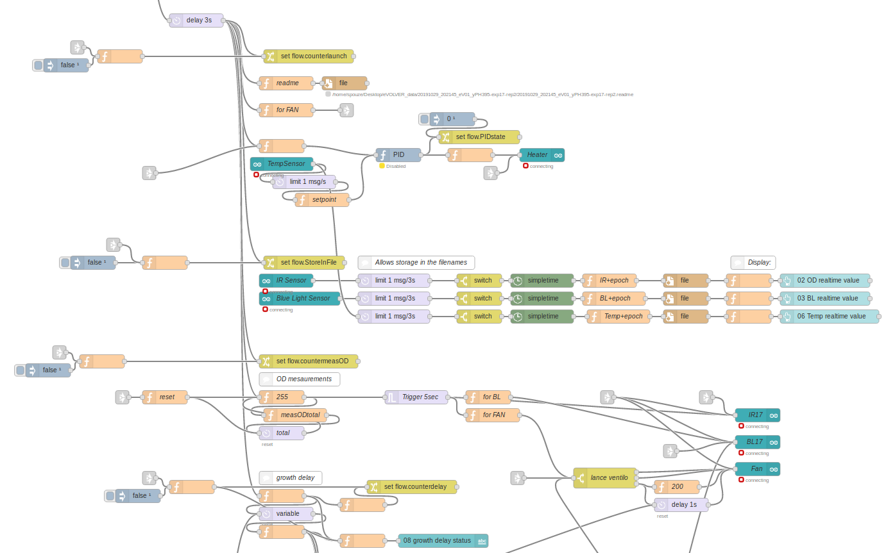
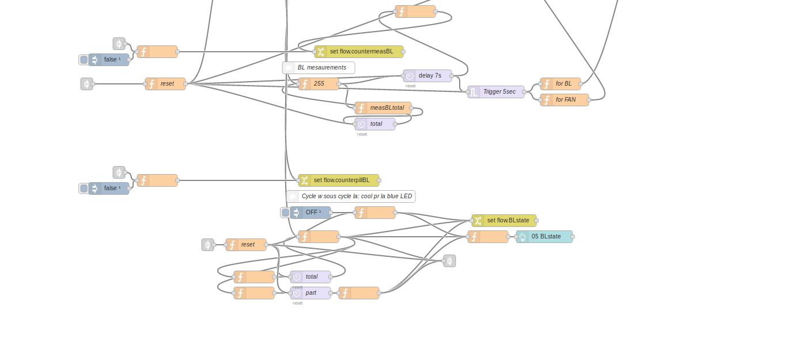

# The User Interface (UI)
Default UI:

# Running code

Ui elements, associated variables.. | ..and display
:-------------------------:|:-------------------------:
  |  

Buttons and Files Processing intialization:

